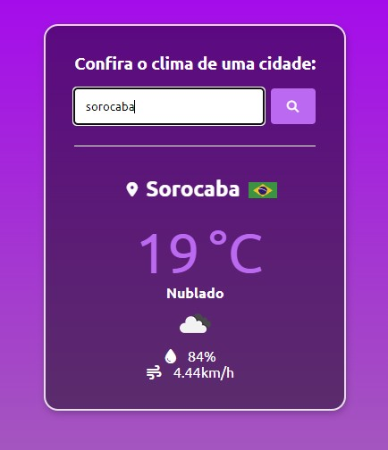

<h1 align="center"> 🌧 Aplicação de Clima 🌧 </h1>

     <h3> Aplicação de Clima com OpenWeather API com base em um <a href="https://www.youtube.com/watch?v=VS8EBgPwsSU&ab_channel=MatheusBattisti-HoradeCodar">tutorial</a></h3>
     
      

     <h2></h2>

+ ### Tecnologias
     
     
     
         
+ ### IDE:
     
